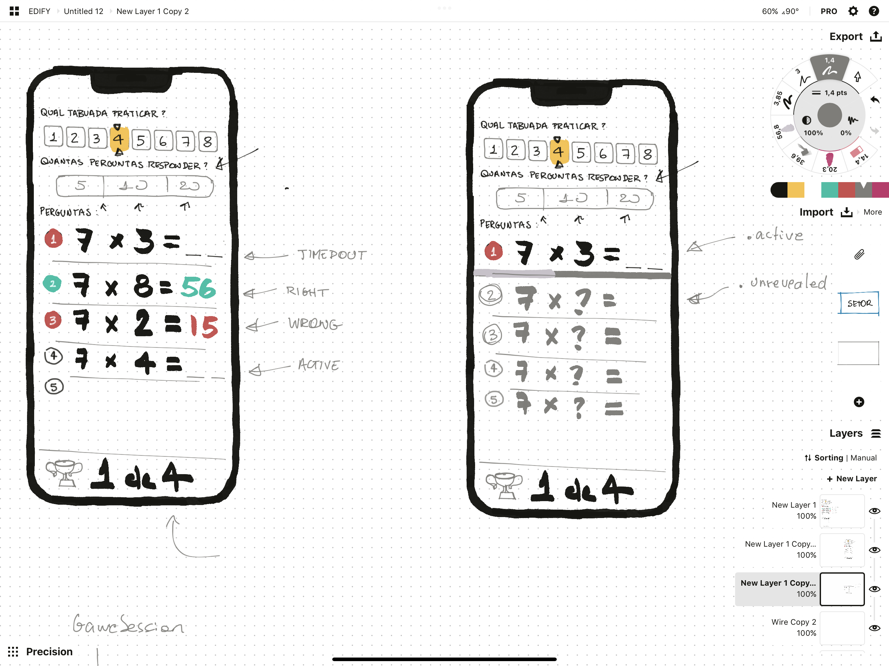

#  Tabulenzo
An iOS app to practice SwiftUI concepts. 

## Motivation
Based on the Challenge proposed by Paul Hudson in his awesome 100 Days of SwiftUI series os articles/videos. 
The challenge is part of the [Day 35 Challenge](https://www.hackingwithswift.com/guide/ios-swiftui/3/3/challenge).

## Prototype
I started sketching an UI: 

