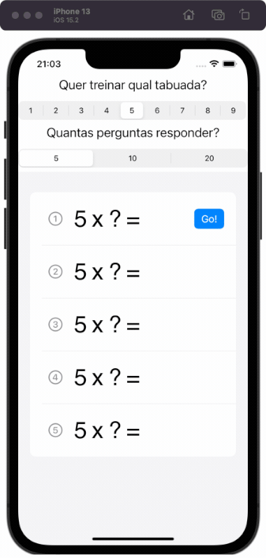

#  Tabulenzo
An iOS app to practice SwiftUI concepts. 

## Motivation
Based on the Challenge proposed by Paul Hudson in his awesome 100 Days of SwiftUI series os articles/videos. 
The challenge is part of the [Day 35 Challenge](https://www.hackingwithswift.com/guide/ios-swiftui/3/3/challenge).
Also the internal qualification program for software developers that i implemented in the [Edify Education](https://www.edifyeducation.com.br) estimulates us to keep studying. In this case i'm studying SwiftUI that's a completely new tech for me (Swift also by the way 😄). 

## Prototype
I started sketching an UI: 

## First functional version:

